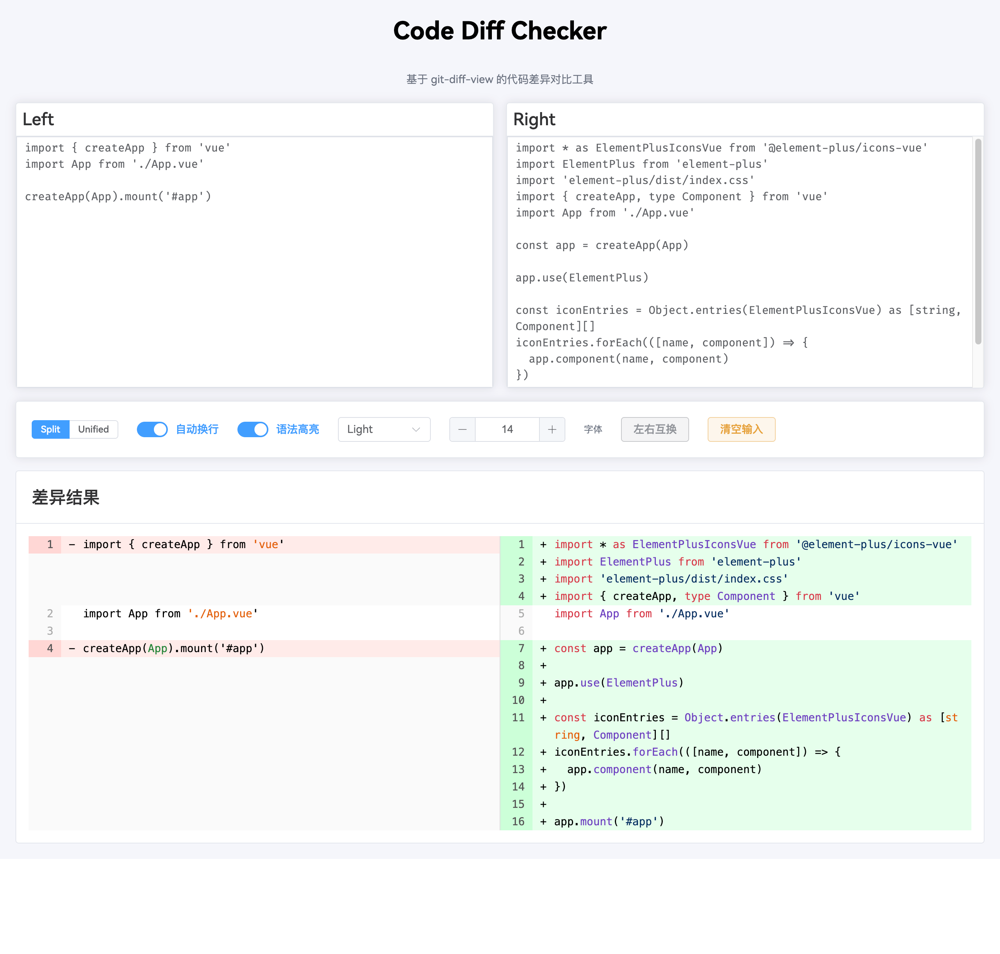

# Code Diff Checker

一个基于 Vue 3 与 `@git-diff-view` 的轻量代码差异预览/比对工具。

## ScreenShot



## 项目使用

可使用 npm / yarn / bun 等包管理工具。

#### 安装依赖

```bash
# npm
npm install

# yarn
yarn install
```

#### 本地开发（默认端口 http://localhost:3001）

```bash
# npm
npm run dev

# yarn
yarn dev
```

#### 生产构建

```bash
# npm
npm run build

# yarn
yarn build
```

#### 本地预览（预览打包产物）

```bash
# npm
npm run preview

# yarn
yarn preview
```

